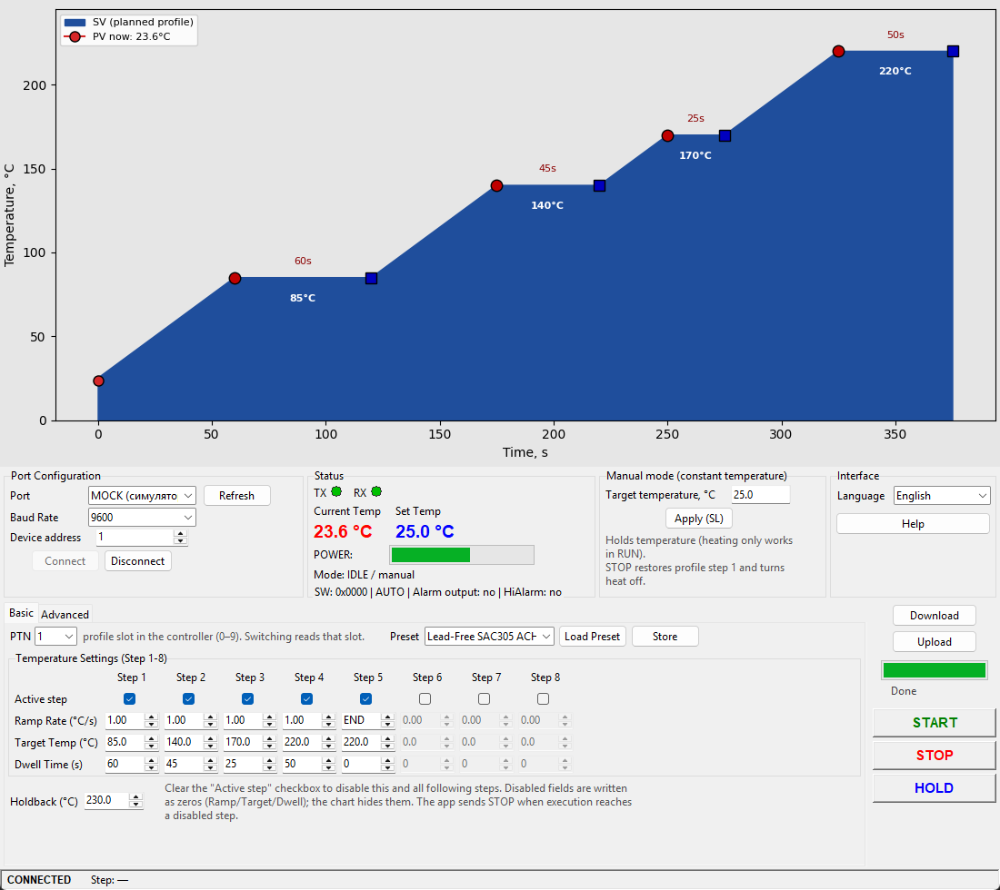

# IR6500 Controller

Python controller for BGA rework stations and other equipment with **ALTEC AL808 / PC900 / PC410** temperature controllers.  
Developed for the **ACHI IR6500**, and also works with the **ALTEC PC410** (same RS-232 protocol).  
The app manages temperature profiles over serial and shows a planned profile chart plus live telemetry (PV / SP / output power).



## Download (Windows)

Ready-to-run executable — no Python required:

**[Download IR6500-Controller.exe](https://github.com/Zikberg/IR6500-Controller/raw/main/dist/IR6500-Controller.exe)**

On first launch, the app creates `config.json` and a `presets/` folder next to the exe.

## Compatible controllers

| Controller | Status |
|------------|--------|
| **ACHI IR6500** (AL808) | Primary target — fully tested |
| **ALTEC PC410** | Compatible (AL808/PC900 protocol) |
| **ALTEC PC900** | Compatible (same protocol as AL808) |

## Features

### Connection & telemetry
- COM port, baud rate (300–19200), and device address (0–99).
- UART format: **7E1** (7 data bits, even parity, 1 stop bit), as required by AL808.
- **TX / RX** indicators, current (**PV**) and set-point (**SP**) temperature, output power (**OP**).
- **SW** status word decoding (auto/manual, alarms, input faults).
- Built-in **simulator** (`MOCK (симулятор)`) for working without hardware.

### Profile chart
- Before **START** — preview of the planned 8-step profile.
- During **RUN** — live PV and SP chart.
- Mouse editing on the chart (drag target temperatures and dwell points).

### Manual mode
- Constant temperature hold via **SL** (local setpoint).
- **STOP** resets the profile to step 1 and turns heating off.

### Basic — heating profile
- **PTN 0–9** — profile slot in the controller (`ch` mnemonic).
- **Steps 1–8** table: Ramp Rate (°C/s), Target Temp (°C), Dwell Time (s).
- **Active step** checkbox — disables this step and all following ones (writes zeros to the device).
- **Holdback** (°C) — allowed deviation from target during dwell.
- **Presets** — save/load profiles as JSON files in `presets/`.
- **Download** (write to device) and **Upload** (read from device).

### Advanced — PID & service parameters
- Read/write AL808 parameters: **HA, LA, DA, XP, TI, TD, HB, LB, CH, CC, RG, HS, LS, BP, HO, SR**.
- **Self-tuning** on/off.
- **Probe** — check which of steps 1–8 the device supports.

### Process control
- **START** — run the profile on the device.
- **STOP** — stop heating.
- **HOLD** — pause the profile (hold current SP).

### UI
- Ukrainian and English (language switch in the right panel).
- Built-in **Help** with usage notes.

## Requirements

- Python **3.10+**
- Windows (tested with COM ports; Tkinter is included with standard Python on Windows)
- Dependencies from `requirements.txt`:
  - `pyserial` — serial communication
  - `matplotlib` — profile charts

## Installation

```powershell
git clone https://github.com/Zikberg/IR6500-Controller.git
cd IR6500-Controller

python -m venv .venv
.venv\Scripts\activate

pip install -r requirements.txt
```

Copy local settings (optional — defaults are created automatically):

```powershell
copy config.json.example config.json
```

## Run

```powershell
python main.py
```

### Quick start without hardware

1. Select `MOCK (симулятор)` in **Port**.
2. Click **Connect**.
3. Load preset **Lead-Free SAC305 ACHI PTN-2** or configure steps manually.
4. Click **Download**, then **START** — live telemetry appears on the chart.

### Connect to real hardware (IR6500, PC410, PC900)

1. Connect the controller to a COM port (e.g. USB-UART CH340).
2. On the device, verify **ADDR** and **BAUD** match the app (typical: address `1`, 9600 baud).
3. Select the port → **Connect** → **Upload** / **Download** / **START**.

## Project layout

```
IR6500-Controller/
├── main.py                 # Entry point
├── requirements.txt
├── config.json.example     # Local settings template
├── docs/
│   └── screenshot.png
├── presets/                # JSON heating profile presets
├── app/
│   ├── gui.py              # Tkinter GUI
│   ├── al808_client.py       # Thread-safe COM / mock client
│   ├── al808_protocol.py     # AL808 frame encode/decode
│   ├── profile_controller.py # Profile logic, RUN/HOLD/PTN
│   ├── presets.py            # Preset load/save
│   ├── mock_al808.py         # Device simulator
│   ├── chart_utils.py        # Chart math
│   ├── config.py             # config.json
│   └── i18n.py               # Localization (uk / en)
├── AL808_protocol.md
└── AL808_Protocol_Reference.md
```

## Units

On the **ACHI IR6500** (unlike some generic PC900 docs):

| Parameter   | UI unit | Device unit |
|-------------|---------|-------------|
| Ramp Rate   | °C/s    | °C/s        |
| Target Temp | °C      | °C          |
| Dwell Time  | seconds | seconds     |
| Holdback    | °C      | °C          |

See `app/profile_controller.py` and `AL808_protocol.md` for details.

## Factory preset

The screenshot shows the **Lead-Free SAC305 ACHI PTN-2** profile from the [ACHI IR6500 User Manual](https://www.bulcomp-eng.com/datasheet/ACHI%20IR6500%20-%20User%20Manual.pdf) (PTN-2, lead-free SAC305):

| Step | Ramp   | Target | Dwell |
|------|--------|--------|-------|
| 1    | 1 °C/s | 85 °C  | 60 s  |
| 2    | 1 °C/s | 140 °C | 45 s  |
| 3    | 1 °C/s | 170 °C | 25 s  |
| 4    | 1 °C/s | 220 °C | 50 s  |
| 5    | END    | —      | —     |
| Holdback | | 230 °C | |

## License

No license specified yet. Add a `LICENSE` file if you plan a public release.

## Disclaimer

This software is provided as-is. **Use at your own risk.** The authors are not liable for any damage to equipment, PCBs, components, or injury resulting from incorrect temperature profiles, misconfiguration, or communication errors. Always verify profiles on scrap boards before rework on production hardware.
